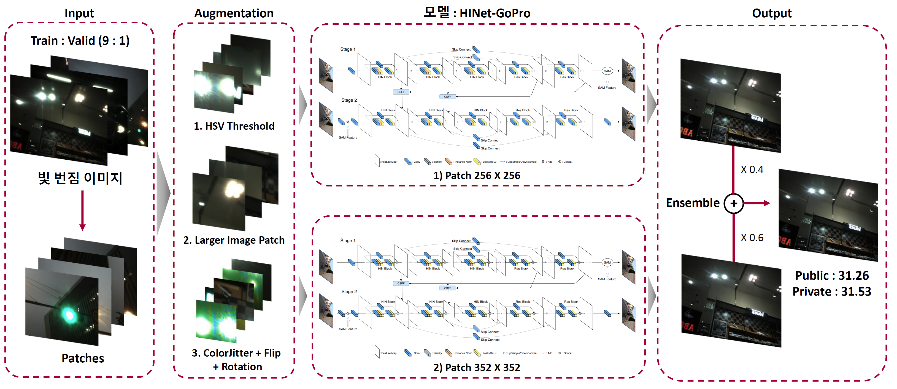
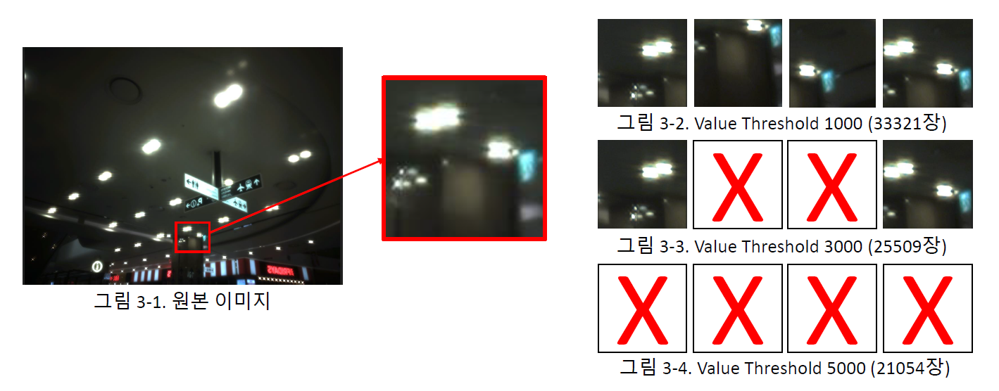
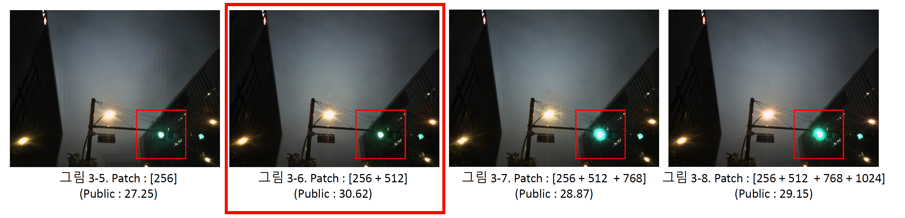
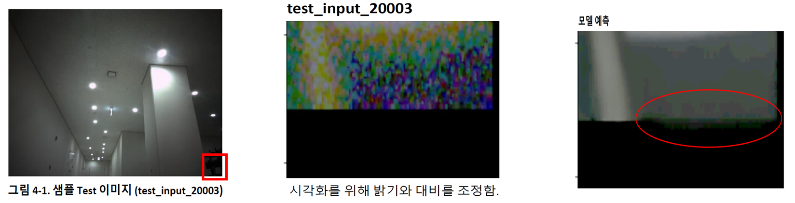
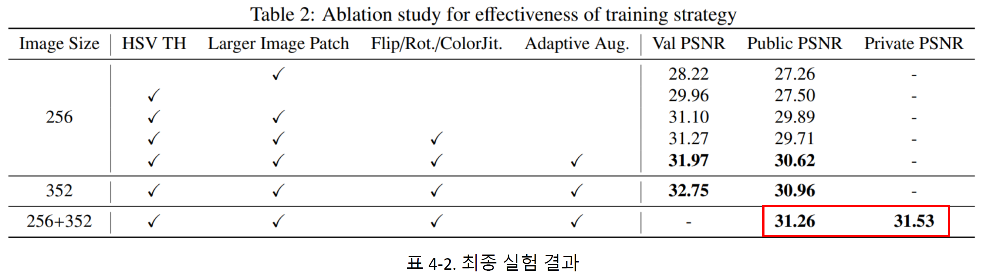
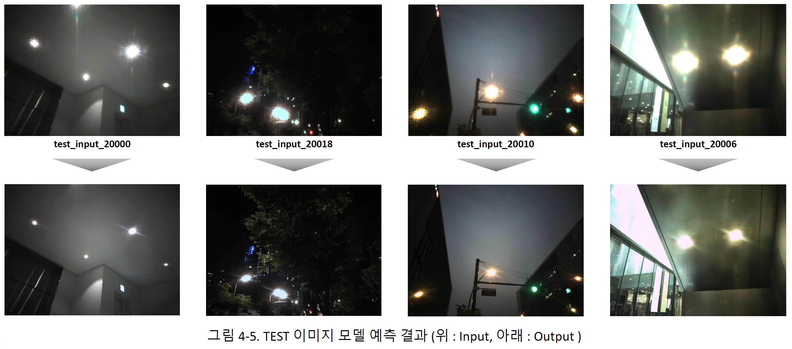

# LG AI Research, Image-Enhancement-4th-place-solution 

This repository is the 4th place solution for [DACON Camera Image Quality Improvement AI Contest](https://dacon.io/competitions/official/235746/overview/description)(카메라 이미지 품질 향상 AI 경진대회).

## Overview
- 빛 번짐으로 저하된 카메라 이미지 품질을 향상시키는 HINet : Half Instance Normalization Network for Image Restoration (Chen, Liangyu, et al. CVPR 2021)기반 AI 모델을 개발했습니다.
- Image Preprocessing & Augmentation이 빛 번짐 제거 학습에 미치는 영향을 분석했습니다.
- Patch단위의 Inference에서 불필요한 연산을 제거함으로써 보다 더 효과적으로 수행하였습니다.
- 전반적인 학습 및 추론 프로세스는 다음 그림과 같습니다.
<div align="center"></div>

## Preprocessing
- HSV Threshold
    - 일반적인 방법으로 Patch 를 생성할 경우 약 16 만장의 이미지가 생성됨. (Patch 256 / Stride 128 기준)
    - HSV 중 Value( 명도 의 threshold 를 설정하여 빛 번짐이 발생한 Patch 를 모델이 집중적으로 학습하도록 함.
    - 최종 모델은 threshold 를 1000 으로 설정함.
    <div align="center"></div>
- Larger Image Patch
    - 단일 크기 Patch 로 학습하여 추론한 Patch 를 합쳤을 때 , Patch 의 가장자리가 격자 형태로 나타나는 문제가 발생함.
    - 모델이 Patch 의 가장자리를 부드럽게 추론할 수 있도록 보다 큰 사이즈의 Patch 를 Resize 하여 학습함.
    - 다양한 Patch 크기 (512 / 768 / 1024) 의 조합에 대하여 실험함.
    <div align="center"></div>

## Augmentation
안정적인 학습을 위해 첫 epoch부터 augmentation은 수행하지 않고, 특정 에폭부터 수행하도록 하는 Adaptive Augmentaion을 수행하였습니다. Augmentation 조합은 아래와 같습니다.
- HorizontalFlip
- VerticalFlip
- RandomRotate90
- ShiftScaleRotate
- ColorJitter
- Resize

## Inference
- Patch단위로 이미지가 존재하기 때문에 끝 단에 해당하는 Patch는 Zero-padding으로 인해 대부분 0으로 채워져 있음.
- 해당 Patch들이 모델 예측 결과에 미치는 영향에 대해 실험함.
- 앞서 제시한 Patch 예측 결과를 통해 Zero Padding 이 포함된 Patch 는 모델 성능에 부정적인 영향을 미친 것으로 판단됨.
- Zero Padding 이 발생한 Patch 중 첫 Stride 에 해당하는 Patch 를 제외한 나머지 Patch 는 추론에 사용하지 않음.
- 그 결과 성능 향상(Public : 0.016, Private : 과 더불어 추론 시간이 상당히 감소함(1614초 -> 1117초). 
<div>
    <div align="center"></div>

## Results
최종적으로 Private(4/228)을 기록하였습니다.
<div align="center"></div>

<div align="center"></div>

***

## Requirements

- Ubuntu 18.04
- Python 3.8.11
- CUDA 11.0
```python
pip install -r requirements.txt
```

## Preprocessing & Augmetation Sample
- sample 폴더에 저장하였습니다.

## Preprocessing
```python
--img_size : patch crop 이미지의 크기
--stride : patch추출에 사용할 stride
--resize : 이미지 resize 크기
--v_threshold : HSV중 V(명도)에 해당하는 threshold
--folds : train, valid를 나눌 fold의 수
--valid_fold : valid set에 해당하는 fold
--patch_growth_count : 더 큰 패치를 자르기위해 img_size에 곱해지는 횟수
--process_num : multiprocess에 할당하는 process의 수
--input_path : 학습에 사용할 input image의 경로
--target_path : 학습에 사용할 target image의 경로
--csv_path : 학습에 사용할 이미지의 해당하는 csv파일의 경로
--save_path : 자른 이미지 저장경로
```

#### 0. data 저장


1) train : 대회에서 배포한 train 데이터와 csv파일을 data/train_original 폴더에 저장합니다.
2) test : 대회에서 배포한 test 데이터를 data 폴더에 저장합니다.

#### 1. 256size : 67065장

`python make_patch.py --img_size 256 --stride 128 --resize 256 --folds 10 --valid_fold 0`

#### 2. 352size : 57497장

`python make_patch.py --img_size 352 --stride 176 --resize 352 --folds 10 --valid_fold 0`


## Training

#### 3. 256size

`python main.py --img_size 256 --exp_num 1`

#### 4. 352size

`python main.py --img_size 352 --exp_num 2`


## testing

#### 5. Inference

- 위에서 학습한 결과는 256size : results/001/, 352size : results/002/ 에 각각 "{size}_best.pth" 모델로 저장됩니다. (처음부터 학습하여 inference를 진행하려면 각 "{size}_best.pth"를 weights 폴더로 이동해 주셔야합니다.)

- training을 전부 진행하지 않고 Inference를 할수 있도록 결과물로 제출한 256_best.pth와, 352_best.pth를 같이 첨부하였습니다. 

`python test.py`